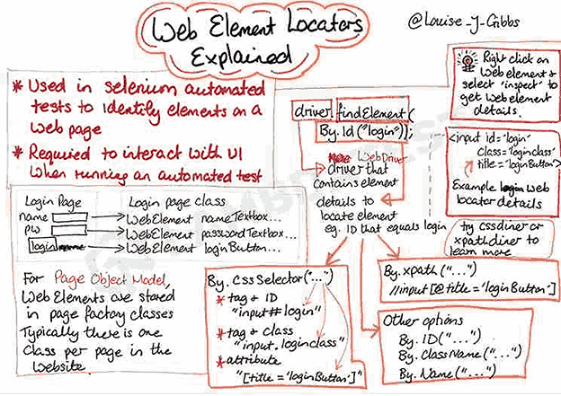

# selenium_with_python
here i will explore selenium with python

**Web Driver**  : 

. one of the component in selenium 
. it is a module
. web driver is an API

.: 3 layer architecture of an web application

# Web driver Architecture  

- web driver contains so many classes and methods. By calling those methods we are able to interact with browser and these action are perfomed under APPLICATION. That's why Web driver is called API.
- 
- Architecture of selenium and it shows how selenium webdriver works
- Selenium Language binding ---> Json wire protocol -->Browser Driver -->W3C --> Browser

- Browser specific driver talk to browser using protocal calles W3C protocol. W3C stands for  **World Wide Web Consortium** and evry web have to follow this standard  protocol
- 
. **Selenium 4 Architecture**  

   
  
- they updated the json protocol to w3c protocol
-  Selenium Language binding ---> W3c -->Browser Driver -->W3C --> Browser

-  **Setup an dconfiguration Selenium in Vscode**  

-  Pre -requisites:
-  python 3
-  Vscode
-  1. Browser driver for chrome (https://chromedriver.chromium.org/downloads)
   2. Browser driver for edge (https://developer.microsoft.com/en-us/microsoft-edge/tools/webdriver/)

  And webdriver version should be compatible with your web browser version
  3. Just open vscode terminal and enter this cmnd to install selenium on your Ide
   - pip install selenium

**Test Case**   

-Open web browser (chrome/edge/firefox)
-Open url https://admin-demo.nopcommerce.com.login
-provide Email (admin@yourstore.com)
- provide password (admin)
- click Login
- Capture title of the Dashboard page. (Actual title)
- verify title of the page : "OrangeHRM" (expected)
- Close Browser

  **Locators**  
  --> WHAT ARE LOCATORS? 
    - Locators are methods that are used to locate HTML web elements for 
      Selenium browser driver.
      
--> WHAT IT IS USED FOR? 
    - It is used to locate any specific web element 
    on the UI of AUT (application under test)
     
    
     

 **Types of locators**  
    

 **Id**:  
 my_element = driver.find_element(By.ID, 'Search box').send_keys("Sammy508")   

 **Name**   
 my_element = driver.find_element(By.Name, 'Submit_Search ').click()   
 instead use this approach   
 password_element = wait.until(EC.presence_of_element_located((By.NAME, "password")))
    password_element.send_keys("admin123")    

 
 **Link Text / Partial link text**  
   

 Most of the time these Locators are mostly used in single web pages   
 . **Id**  
 . **Name**  
 . **Linktext**  
 . **partial Linktext**   
 
 Sometimes we need to find out More than 1 elements in that case we use  these locators like   
 . **Classname**  
 eg:  slider = driver.find_elements(By.CLASS_NAME, "homeslider-Container")  
print(len(slider))   
   

 . **Tagname**  

 Eg:   links = driver.find_elements(By.TAG_NAME, "a")  
 print(len(links))
 

 **By. CLASS_NAME**
 
   driver.get("http://www.automationpractice.pl/index.php")

   sliders = wait.until(EC.presence_of_all_elements_located((By.CLASS_NAME, "homeslider-container")))
   print(len(sliders))

**CSS Selectors**
We can address css selectors by  
1. tag and ID    (tagname#ID) 
2. tag and class   (tagname.class)  
3. tag and attribute   (tagname[attribut = value]) 
4. tag class and attribute   (tagname.class[attribute= value])  

 
****Xpath****  
- Xpath are defined as Xml path   
-It uses HTML DoM Structure to locate elemnt on web page  
-Its an address of an elemnt   
**Types** of xpath  :  
.Relative Xpath (partial xpath)  
      Eg: //*[@id="u_0_9_UA"] (facebbok login button's rel xpath)
.Absolute Xpath (Full xpath)  
      Eg : /html/body/div[1]/div[1]/div[1]/div/div/div/div[2]/div/div[1]/form/div[2]/button  (Full xpath)
 
**DOM STRUCTURE** :  
. Dom is an API interface provided by browser   
. When a web page is loaded, the browser creates a Document Object model of the page  

# Difference Between Absolute and Relative Xpath  
 1. Absolute path statrts from Root HTML Node
  Relative Xpath directly jumps to element on DOM   
2. Absolute xpath start with / But Relative xpath starts with //     
3. In Absolute xpath we use only tags/ nodes But in Relative xpath we use Attributes   

  We can use ** **selector HUb extension** **  on browser to capture x path automatically   

** **Reason to Pick relative xpath**   
1. If developer introduce new element then absolute path will be broken
2. If Dev change the location then absolute xpath will be broken S0, we haave to pick relative xpath    
Absolute path are not Stable  

**Xpath Options**   

and, or, contains(), start-with(), text()    

 # Xpath with OR operator
 wait.until(EC.presence_of_element_located((By.XPATH, "//input[@id='q' or @placeholder = 'search']"))).send_keys(search)

 # xpath with and operator
 
 wait.until(EC.presence_of_element_located((By.XPATH, "//input[@id='q' and @placeholder = 'search']"))).send_keys(search)

# path with contains()

wait.until(EC.element_to_be_clickable((By.XPATH, "//*[contains(@class,'cart-icon-daraz')]"))).click()

# path with strat-with()

wait.until(EC.element_to_be_clickable((By.XPATH, "//*[starts-with(@type,'submit')]"))).click()

# Xpath Axes  
  An axis represents a relationship to the context (current) node, and is used to locate nodes relative to that node on the tree.   
     
  

# # self  xpath axes
 text_msg = driver.find_element(By.XPATH,"//a[contains(text(),'KFIN Technologies')]/self::a").text
 print(text_msg)

# # xpath with parents

 text_msgparent= driver.find_element(By.XPATH,"//a[contains(text(),'KFIN Technologies')]/parent::h4").text
 print(text_msgparent)
 KFIN Technologies  it prints the same value of self because its parent doesnt have any text

# child
text_msgchild= driver.find_elements(By.XPATH,"//a[contains(text(),'KFIN Technologies')]/ancestor::div/ancestor::div")
print(len(text_msgchild))

# ancestor
text_ances= driver.find_elements(By.XPATH,"//a[contains(text(),'KFIN Technologies')]/parent::h4/child::div")
print(len(text_ances))

# desendants node

text_dece = driver.find_elements(By.XPATH, "//a[contains(text(),'KFIN Technologies')]/ancestor::div/parent::div/descendant::*")
print(len(text_dece))

# Preceding Sibling
Definition: Selects only sibling nodes that come before the current node at the same level in the hierarchy.

 #preceding - sibling
text_pre= driver.find_elements(By.XPATH,"//a[contains(text(),'KFIN Technologies')]/ancestor::div/ancestor::div/preceding-sibling::*")
print(len(text_pre))

# following sibling

its also like a preceding ones   
#following - sibling
text_foll= driver.find_elements(By.XPATH,"//a[contains(text(),'KFIN Technologies')]/ancestor::div/ancestor::div/following-sibling::div")
print(len(text_foll))

 
 

  

